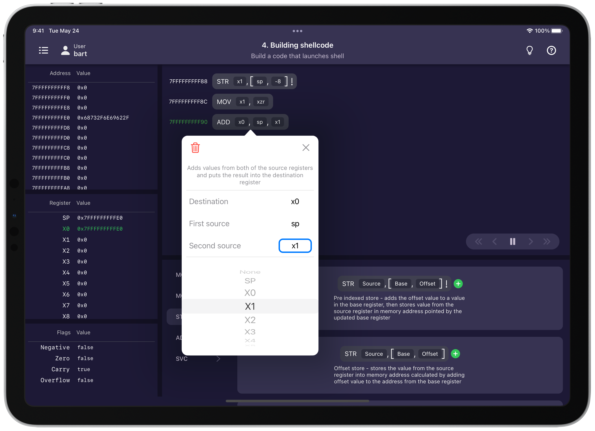
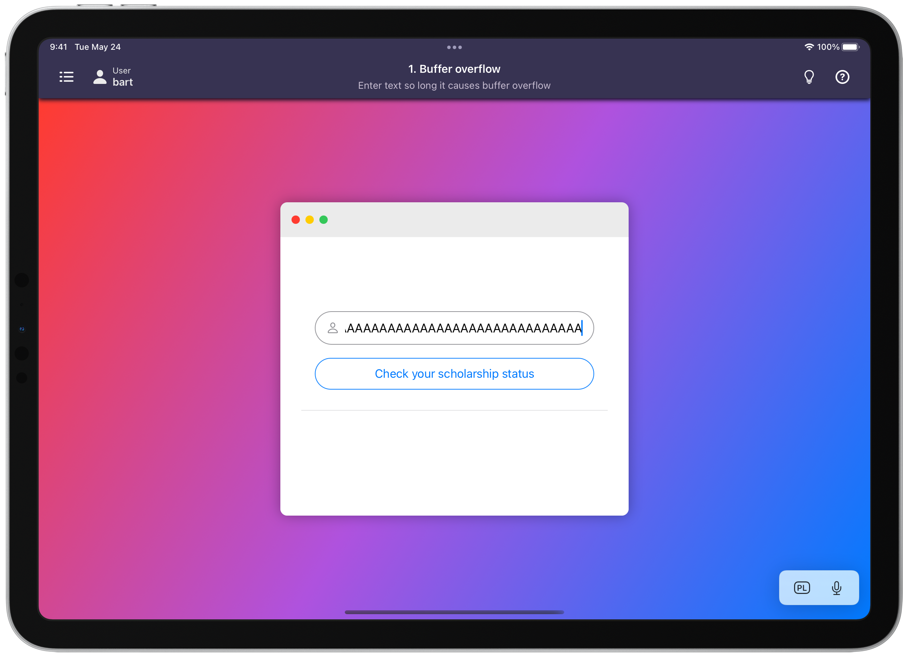
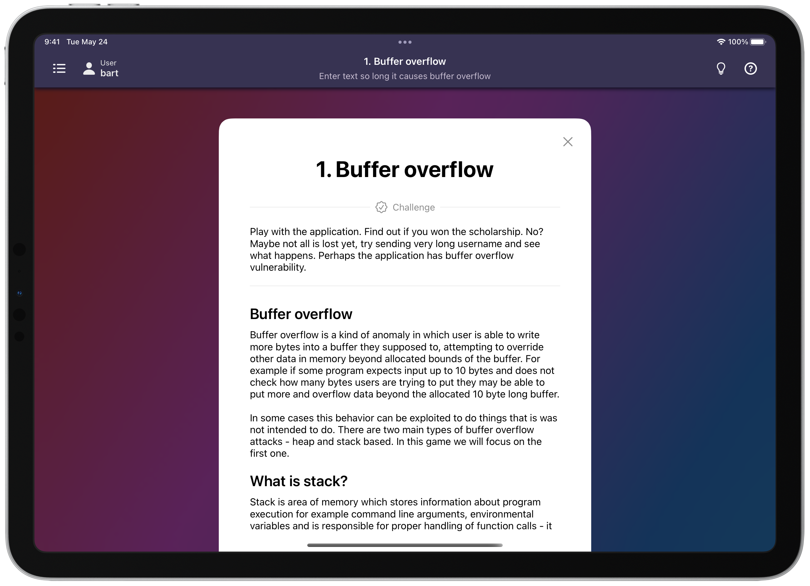
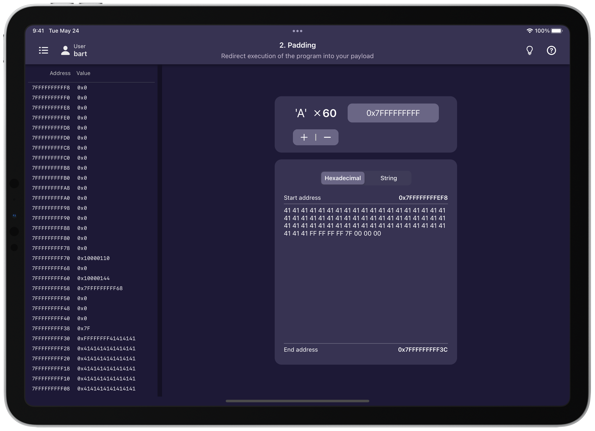

# Pwnground

## Project overview
Pwnground is a project created as my submission for WWDC22 Swift Student Challenge (winner). It is an interactive Swift Playground guiding through principles of binary exploitation with focus on stack-based buffer overflow vulnerability. The project involves own exploit playground environment created over ARM64 CPU emulator, simple XNU kernel simulator as well as live debugger displaying what each of the executed instructions does and how it affects CPU registers, memory and flags for better understanding of ARM64 assembly language and of what the created exploit actually does.

## Description

In the playground user is guided to create an exploit for a vulnerable application displaying WWDC Scholarship results in order to escalate privileges and assign themselves to a group of winners. Tutorial is divided for 5 parts with step-by-step introduction to all the concepts behind exploiting simple stack-based buffer overflow vulnerability.

1. <strong>Buffer overflow</strong> - Playing with application input and learning how buffer overflow works using the vulnerable application as an example.
2. <strong>Padding</strong> - Redirecting of execution flow. Finding correct padding and overriding return address to cause arbitrary code execution.
3. <strong>Shellpath</strong> - Learning basics of ARM64 assembly and CPU registers building shell path string on the CPU level.
4. <strong>Shellcode</strong> - Interacting with operating system with assembly using syscalls requesting to spawn system shell through the exploited app.
5. <strong>Exploitation</strong> - Using the created exploit to escalate user privileges and assigning user to system group of the winners.

## Technical overview

To simulate real behavior of devices during exploitation of buffer overflow vulnerabilieies the project was designed to simulate all the most relevant things that happen from the bit level of executing instructions by the CPU, through kernel subrutines up to standard input / output handling. For the project I have implemented ARM64 emulator covering execution of few dozen of the most commonly used ARM64 CPU instructions alongside the [official ARM Instruction Set Reference](https://developer.arm.com/documentation/ddi0596) to emulate behavior of the real Apple Silicon CPU. On the software level, there is simple XNU kernel simulator which is capable of parsing and executing simple Mach-O executables on the emulator keeping compliance with Apple Platforms like Mach-O binary format, dynamic linking handling, syscalls, virtual memory implementation, function call convention etc. It is not full ARM64 emulator nor full XNU simulator but it covers enough for running simple programs and basic experimenting with ARM64 assembly for the purposes of learning basics of buffer overflow vulnerability exploitation.

Whole project has been created with Swift using pure iOS SDK using SwiftUI and Combine with no external libraries / frameworks.

## Running project

The project was designed for iPad Pro devices with target of iOS 15.2 and newer.
Builds have been tested on following configurations:
- macOS 12.3 and Xcode 13.3 (when building on a Mac)
- Swift Playgrounds 4.0.2 (when building directly on an iPad)

### Swift Playgrounds on iPad

Project can be run directly on iPad by opening the `Pwnground.swiftpm` project file in Swift Playgrounds app (4.0.2 or later) and clicking `Run` button. Please note that building the project on Swift Playground on iPad is significally slower than in Xcode on Mac and it may take some while to build the app.

### Xcode on Mac

Other way is to build the project on Mac by opehing the `Pwnground.swiftpm` project file in the Xcode (13.3 or later) and running by simply clicking `Run`. Project was designed for iPad Pro devices but it also works well fine as standalone macOS app on Apple Silicon Macs.